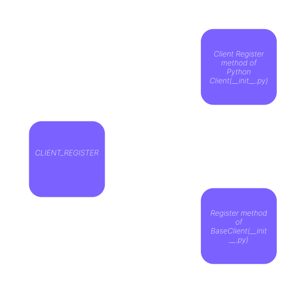

# PyGlobalInterface

<!--  -->

PyGlobalInterface is a TCP-based interface that connects client programs globally, allowing them to export functions that can be used by other connected clients. This cross-language compatible interface leverages the PyGlobalInterface client library, ensuring seamless integration with client programs written in any language. 

## 🚀 Features
- **Cross-Language Compatibility**: Supports client programs written in any language with the PyGlobalInterface client library.
- **Function Exporting**: Clients can export functions to be used by other clients.
- **Thread-Safe Execution**: Each function invocation runs in a separate thread and returns the function output.
- **Low Communication Overhead**: Achieves communication overhead between 0.00028 to 0.00039 seconds on localhost with multiple clients.

## 📦 Getting Started

### Step 1: Start the Main Server
Clone the repository and start the main server:

```bash
git clone https://github.com/anshjoseph/PyGlobalInterface.git
cd PyGlobalInterface
python3 main.py
```

### Step 2: Run the Demo

Navigate to the Python demo directory and run the client scripts.

#### Host Client (Exports Function)
```bash
cd Demo/PythonDemo
python3 client1.py
```

#### Client Using Exported Function
```bash
python3 client2.py
```

## 📝 Notes
- Ensure that the exported functions are thread-safe, as each function invocation creates a new thread.
- No additional dependencies are required to run the PyGlobalInterface.

## 📁 Project Structure
```
PyGlobalInterface/
├── Demo/
│   └── PythonDemo/
|       ├── PythonClient/ (lib)
│       ├── client1.py
│       └── client2.py
|
├── PyGlobalInterface/ (lib)
├── main.py
└── README.md
```

## 💻 Client Implementation Examples

### Python Client Example
**client1.py**
```python
from PythonClient import PyGlobalInterface_Client
from asyncio import sleep
import time 

# register client
client = PyGlobalInterface_Client("program1")
if client.client_register():
    print("sucessful registration")

# function to be exported
def run_print(data:dict):
    print(data['val'])
    time.sleep(1)
    return {"output":data["val"]}

# exporting function    
if client.func_register("run_print",run_print):
    print("sucessful registration")

# run for ever because its working as host    
async def run_forever():
    while True:
        await sleep(3)
try:
    client.loop.run_until_complete(run_forever())
except Exception as e:
    print(e)

```

**client2.py**
```python
from PythonClient import PyGlobalInterface_Client
from asyncio import sleep
import uuid


client = PyGlobalInterface_Client(f"{uuid.uuid4()}")

if client.client_register():
    print("sucessful registration")


tasks = []
for i in range(1000):
    # to call function client_name@function_name use client name from which you want to call the function
    task = client.loop.create_task(client.call_function("program1@run_print",data={"val":f"hello from {client.client_name}"}))
    client.loop.run_until_complete(task)


client.loop.close()

```




## 📄 License
This project is licensed under the MIT License - see the [LICENSE](LICENSE) file for details.

## 📞 Support
For support, please open an issue or contact us at ranshjosrph@gmail.com

---

Feel free to customize this README to fit your specific needs.
